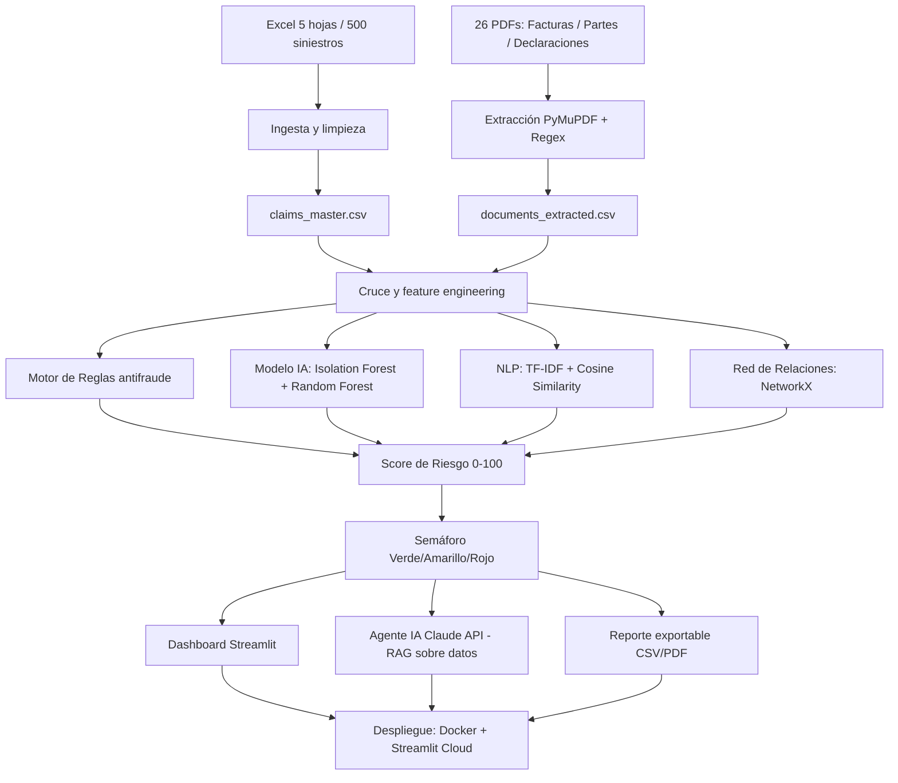
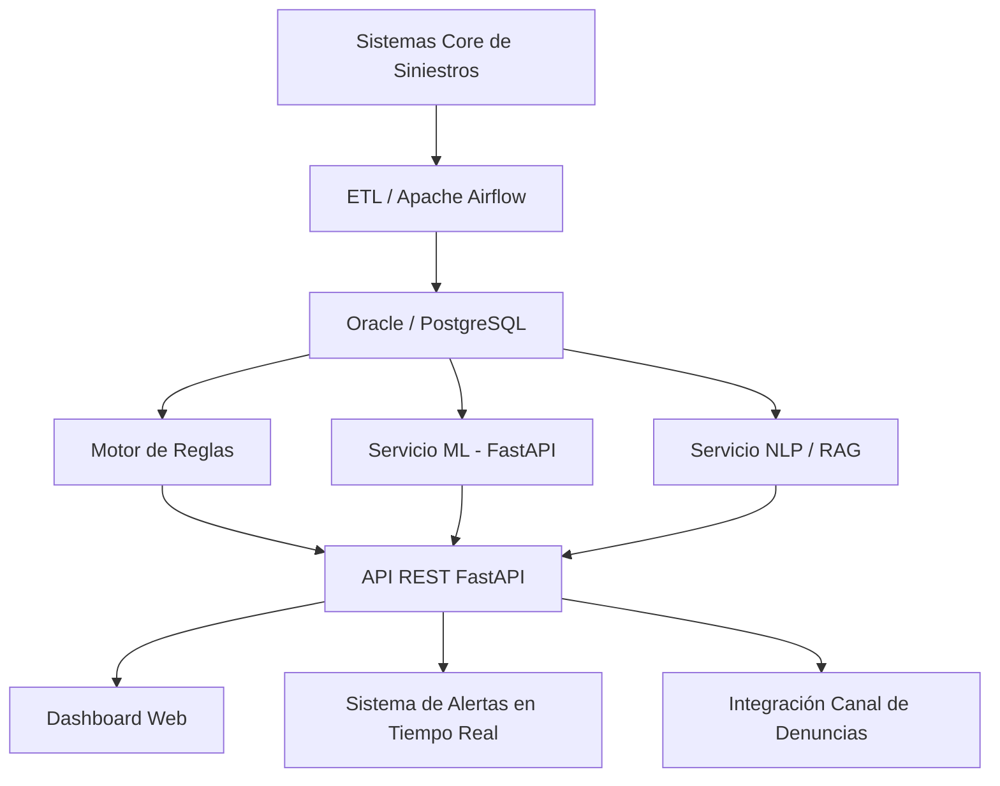

# Plan de Desarrollo — FraudIA Claims (Aseguradora del Sur)
## Objetivo: 5/Excepcional en todos los criterios de evaluación

---

## 0. Contexto del reto y objetivo de puntuación máxima

### Matriz de evaluación (puntuación objetivo: 5 en todos)

| Dimensión | Peso | Qué exige el nivel 5 (Excepcional) |
|---|---|---|
| Tecnología y Arquitectura | 10% | Código de nivel producción, modular, con documentación técnica profunda |
| Análisis del Caso y Lógica | 15% | Detecta patrones complejos como **redes de relación** o anomalías no evidentes |
| **Uso de IA y Prototipo** | **40%** | **Enfoque híbrido: ML + NLP + Agente de IA para consultas en lenguaje natural** |
| Explicabilidad y Ética | 25% | El Agente de IA redacta justificaciones; documenta riesgos, sesgos y garantiza que la IA sea solo una alerta |
| Pitch, Impacto y Negocio | 10% | Pitch persuasivo que demuestra valor real y escalabilidad futura |

> El criterio de mayor peso (40%) exige explícitamente: ML + NLP + Agente IA con Claude/ChatGPT.
> El segundo criterio (25%) exige que el agente redacte resúmenes narrativos justificando el riesgo.

### Principio clave
La solución genera alertas de revisión. **No acusa fraude. No rechaza siniestros automáticamente.**

---

## 1. Dataset disponible (columnas reales — no inventar)

### 1_Siniestros (500 filas)
```
ID Siniestro, ID Póliza, ID Asegurado, Ramo, Placa Vehículo Asegurado,
Cobertura, Fecha Ocurrencia, Fecha Reporte, Días Ocurr→Reporte,
Monto Reclamado ($), Monto Estimado ($), Monto Pagado ($), Estado,
Sucursal, ID Proveedor, Descripción del Evento, Docs Completos,
Prov. Lista Restrictiva, Días desde Inicio Póliza, Días hasta Fin Póliza,
N° Reclamos Previos Asegurado, Suma Asegurada ($), Similitud Narrativa Máx.,
Número Parte Policial
```

### 2_Polizas (500 filas)
```
ID Póliza, ID Asegurado, Ramo, Fecha Inicio, Fecha Fin, Suma Asegurada ($),
Prima Anual ($), Canal Venta, Estado Póliza
```

### 3_Asegurados (174 filas)
```
ID Asegurado, Nombres Asegurado, Segmento, Ciudad, Antigüedad (años),
N° Pólizas Activas, N° Reclamos Últimos 12 Meses, N° Reclamos Histórico Total,
Reclamos RC sin Tercero, Perfil Riesgo Histórico
```

### 4_Proveedores (33 filas)
```
ID Proveedor, Nombre Proveedor, Tipo, Ciudad, N° Siniestros Asociados,
En Lista Restrictiva, Motivo Restricción, Promedio Monto ($)
```

### 5_Documentos (1263 filas)
```
ID Documento, ID Siniestro, Tipo Documento, Nombre Archivo PDF
```

### PDFs disponibles
- **FACTURAS** (15 archivos): SIN-0001, 0003, 0004, 0005, 0006, 0007, 0008, 0009, 0010, 0022, 0028, 0029, 0030, 0032, 0035
- **PARTE POLICIAL** (6 archivos): SIN-0005, 0022, 0040, 0120, 0217, 0344
- **DECLARACIÓN DE ACCIDENTE** (5 archivos): SIN-0378, 0401, 0427, 0448, 0456
- Total: 26 PDFs reales disponibles

> Nota: El Excel ya incluye campos pre-calculados (`Similitud Narrativa Máx.`, `Días Ocurr→Reporte`, `Prov. Lista Restrictiva`, etc.) que simplifican las reglas para los 500 siniestros. Los PDFs enriquecen el análisis de los ~26 casos que los tienen.

---

## 2. Arquitectura del sistema

### 2.1 Arquitectura MVP (lo que se construye)



### 2.2 Arquitectura futura escalable



---

## 3. Stack tecnológico completo

### Aplicación principal
| Tecnología | Uso |
|---|---|
| Python 3.11 | Lenguaje principal |
| Streamlit | Dashboard y UI |
| Plotly | Visualizaciones interactivas |
| Pandas / NumPy | Procesamiento de datos |
| openpyxl | Lectura del Excel |
| PyMuPDF (`fitz`) | Extracción de PDFs |
| pdfplumber | Extracción alternativa de PDFs |
| scikit-learn | Isolation Forest, Random Forest, TF-IDF |
| joblib | Serialización de modelos |
| rapidfuzz | Similitud textual ligera |
| **networkx** | **Análisis de redes de relaciones (nivel 5)** |
| **anthropic** | **Claude API — Agente IA explicativo (nivel 5)** |
| python-dotenv | Variables de entorno |
| pytest | Tests |

### Entrenamiento (Google Colab)
| Tecnología | Uso |
|---|---|
| scikit-learn | Isolation Forest + Random Forest |
| xgboost | Modelo alternativo |
| SHAP | Importancia de variables y explicabilidad |
| sentence-transformers | Embeddings semánticos opcionales |

### Despliegue
| Tecnología | Uso |
|---|---|
| **Docker** | Contenedor reproducible |
| **Streamlit Community Cloud** | Hosting gratuito — conecta directo a GitHub |
| GitHub | Repositorio + CI |
| `.env` / Streamlit Secrets | API keys en producción |

---

## 4. Estructura del repositorio

```text
fraudia-claims/
├── README.md
├── requirements.txt
├── environment.yml          ← para Anaconda local
├── Dockerfile               ← para despliegue
├── .dockerignore
├── .env.example
├── .gitignore
├── .streamlit/
│   └── secrets.toml.example ← plantilla de secrets para Streamlit Cloud
├── data/
│   ├── raw/
│   │   ├── excel/
│   │   │   └── Evento_Datasets_Sinteticos_Fraude_500_v2.xlsx
│   │   └── pdfs/
│   │       ├── facturas/
│   │       ├── partes_policiales/
│   │       └── declaraciones_accidente/
│   ├── processed/
│   │   ├── claims_master.csv
│   │   ├── documents_extracted.csv
│   │   ├── claims_with_documents.csv
│   │   ├── claims_scored.csv
│   │   └── network_edges.csv       ← grafo de relaciones
│   └── outputs/
│       ├── reportes/
│       └── exports/
├── models/
│   ├── fraud_model.pkl
│   ├── scaler.pkl
│   ├── model_columns.json
│   └── metrics.json
├── notebooks/
│   └── entrenamiento_colab.ipynb
├── src/
│   ├── ingestion/
│   │   ├── __init__.py
│   │   └── load_excel.py
│   ├── pdf_extraction/
│   │   ├── __init__.py
│   │   ├── extract_pdfs.py
│   │   ├── extract_facturas.py
│   │   ├── extract_declaraciones.py
│   │   └── extract_partes_policiales.py
│   ├── features/
│   │   ├── __init__.py
│   │   └── build_features.py
│   ├── rules/
│   │   ├── __init__.py
│   │   └── fraud_rules.py
│   ├── scoring/
│   │   ├── __init__.py
│   │   └── risk_score.py
│   ├── models/
│   │   ├── __init__.py
│   │   └── predict_model.py
│   ├── nlp/
│   │   ├── __init__.py
│   │   └── narrative_similarity.py
│   ├── network/                     ← NUEVO: análisis de redes
│   │   ├── __init__.py
│   │   └── relationship_graph.py
│   ├── explainability/
│   │   ├── __init__.py
│   │   └── explain_score.py
│   ├── ai_agent/
│   │   ├── __init__.py
│   │   ├── claims_agent.py          ← Claude API + RAG
│   │   └── query_engine.py          ← fallback sin API
│   └── app/
│       ├── app.py
│       ├── pages/
│       │   ├── 1_Dashboard.py
│       │   ├── 2_Bandeja_Casos.py
│       │   ├── 3_Detalle_Siniestro.py
│       │   ├── 4_Analisis_Documental.py
│       │   ├── 5_Red_Relaciones.py  ← NUEVO: grafo interactivo
│       │   ├── 6_Agente_IA.py
│       │   └── 7_Reportes.py
│       └── components/
│           ├── charts.py
│           ├── tables.py
│           └── filters.py
├── docs/
│   ├── arquitectura.md
│   ├── modelo_datos.md
│   ├── reglas_negocio.md
│   ├── uso_ia.md
│   ├── limitaciones.md
│   ├── sesgo_y_etica.md             ← NUEVO: para nivel 5 en Explicabilidad
│   └── guia_demo.md
├── tests/
│   ├── test_rules.py
│   ├── test_scoring.py
│   └── test_pdf_extraction.py
└── presentation/
    └── pitch.pdf
```

---

## 5. Fases de desarrollo

### Fase 0 — Repositorio y ambiente

**Objetivo:** Base del proyecto, carpetas, dependencias.

**Tareas:**
1. Crear repositorio `fraudia-claims` en GitHub.
2. Crear estructura de carpetas.
3. Crear `requirements.txt` y `environment.yml`.
4. Crear `.env.example` y `.streamlit/secrets.toml.example`.
5. Crear `.gitignore` (excluir `.env`, `*.pkl`, PDFs originales pesados).
6. Copiar dataset a `data/raw/`.
7. Crear `Dockerfile` base.

**requirements.txt:**
```txt
pandas>=2.0
numpy
openpyxl
streamlit>=1.35
plotly
scikit-learn
joblib
python-dotenv
pymupdf
pdfplumber
regex
pytest
rapidfuzz
networkx
anthropic
xgboost
```

**Dockerfile:**
```dockerfile
FROM python:3.11-slim
WORKDIR /app
COPY requirements.txt .
RUN pip install --no-cache-dir -r requirements.txt
COPY . .
EXPOSE 8501
CMD ["streamlit", "run", "src/app/app.py", "--server.port=8501", "--server.address=0.0.0.0"]
```

---

### Fase 1 — Carga y limpieza del Excel

**Objetivo:** Leer las 5 hojas y generar `claims_master.csv`.

**Archivo:** `src/ingestion/load_excel.py`

**Columnas reales del Excel a normalizar:**
```python
COLUMN_MAP = {
    "ID Siniestro": "id_siniestro",
    "ID Póliza": "id_poliza",
    "ID Asegurado": "id_asegurado",
    "Ramo": "ramo",
    "Placa Vehículo Asegurado": "placa",
    "Cobertura": "cobertura",
    "Fecha Ocurrencia": "fecha_ocurrencia",
    "Fecha Reporte": "fecha_reporte",
    "Días Ocurr→Reporte": "dias_ocurrencia_reporte",
    "Monto Reclamado ($)": "monto_reclamado",
    "Monto Estimado ($)": "monto_estimado",
    "Monto Pagado ($)": "monto_pagado",
    "Estado": "estado",
    "Sucursal": "sucursal",
    "ID Proveedor": "id_proveedor",
    "Descripción del Evento": "descripcion",
    "Docs Completos": "docs_completos",
    "Prov. Lista Restrictiva": "proveedor_lista_restrictiva",
    "Días desde Inicio Póliza": "dias_desde_inicio_poliza",
    "Días hasta Fin Póliza": "dias_hasta_fin_poliza",
    "N° Reclamos Previos Asegurado": "historial_siniestros_asegurado",
    "Suma Asegurada ($)": "suma_asegurada",
    "Similitud Narrativa Máx.": "similitud_narrativa",
    "Número Parte Policial": "numero_parte_policial",
}
```

**Cruces a generar:**
- Siniestros ← Pólizas (por `id_poliza`)
- Siniestros ← Asegurados (por `id_asegurado`)
- Siniestros ← Proveedores (por `id_proveedor`)
- Siniestros ← Documentos (conteo por `id_siniestro`)

**Salida:** `data/processed/claims_master.csv`

---

### Fase 2 — Extracción de PDFs ✅ COMPLETADA

**Objetivo:** Extraer campos de los 26 PDFs disponibles y crear tabla documental.

**Resultados sobre datos reales:**
- 26/26 PDFs procesados sin errores
- 5 facturas con RUC inválido (SIN-0004, 0005, 0006, 0009, 0022)
- 5 facturas con documento alterado (SIN-0004, 0005, 0006, 0009, 0022)
- 4 partes policiales tardíos: SIN-0022 (17d), SIN-0120 (13d), SIN-0217 (12d), SIN-0344 (11d)
- 1 robo sin denuncia previa (SIN-0005)
- 3 declaraciones sin testigos (SIN-0448, SIN-0456, SIN-0427)
- 54 tests pasando

**Archivos:** `src/pdf_extraction/`

**Estrategia:**
- Los 26 PDFs enriquecen los ~26 siniestros específicos.
- Los 474 siniestros restantes se analizan solo con el Excel.
- Los campos extraídos se cruzan con `5_Documentos` por `ID Siniestro`.

**Campos a extraer por tipo:**

Facturas (15 PDFs):
```
id_siniestro, proveedor, ruc, fecha_factura, numero_factura,
placa, subtotal, iva, total, descripcion,
factura_alterada (bool), ruc_invalido (bool), fecha_previa_al_evento (bool)
```

Partes Policiales (6 PDFs):
```
id_siniestro, numero_parte, fecha_elaboracion, fecha_hecho,
lugar, tipo_accidente, robo, perdida_total, lesionados,
detenidos, flagrancia, observaciones,
parte_tardio_dias (int)
```

Declaraciones de Accidente (5 PDFs):
```
id_siniestro, nombre_asegurado, placa, fecha_accidente, hora,
lugar, relato, danos_declarados, tercero_identificado (bool),
testigos (bool), autoridades (bool), asistencia_medica (bool)
```

**Alertas documentales generadas:**
- `factura_alterada`: texto contiene "DOCUMENTO ALTERADO"
- `ruc_invalido`: RUC contiene "INVÁLIDO" o formato incorrecto
- `parte_tardio`: `fecha_elaboracion - fecha_hecho > 7 días`
- `fecha_factura_previa`: fecha factura anterior a fecha del siniestro
- `sin_denuncia_previa`: texto contiene "sin denuncia previa"
- `tercero_no_identificado`: declaración sin tercero identificado

**Salida:** `data/processed/documents_extracted.csv`

---

### Fase 3 — Feature engineering y cruce ✅ COMPLETADA

**Objetivo:** Generar tabla unificada con todas las variables de riesgo.

**Archivo:** `src/features/build_features.py`

**Resultado real (2026-05-29):**
- `claims_with_documents.csv`: 500 filas, 87 columnas
- Siniestros con PDFs enriquecidos: 24
- Señales documentales cruzadas: `doc_factura_alterada`, `doc_ruc_invalido`, `doc_caso_fraude`, `doc_sin_denuncia_previa`, `doc_parte_tardio`, `doc_sin_testigos`, `doc_tercero_identificado`, etc.
- Alertas combinadas generadas: `alerta_robo_sin_denuncia`, `alerta_similitud_sin_testigos`, `alerta_proveedor_fraude_documental`
- `score_documental_raw` (0-100) calculado por siniestro
- SIN-0005: score_documental = 90 (factura_alterada + ruc_invalido + caso_fraude + sin_denuncia)
- 24/24 tests pasando — `tests/test_build_features.py`

**Variables derivadas (además de las ya en el Excel):**

```python
# Ratio de monto
ratio_monto_suma = monto_reclamado / suma_asegurada  # >0.95 → alerta

# Anomalía de monto vs promedio del proveedor
delta_monto_proveedor = monto_reclamado - promedio_monto_proveedor

# Perfil de riesgo combinado
perfil_riesgo_asegurado  # de hoja 3_Asegurados

# Variables documentales (de PDFs o de hoja 5_Documentos)
tiene_factura, tiene_parte_policial, tiene_declaracion
cantidad_documentos, docs_completos
factura_alterada_detectada, ruc_invalido_detectado
parte_tardio_detectado, tercero_no_identificado

# Hora del siniestro (si está en PDFs)
hora_siniestro  # para regla de madrugada
```

**Salida:** `data/processed/claims_with_documents.csv`

---

### Fase 4 — Motor de reglas antifraude ✅ COMPLETADA

**Objetivo:** Reglas explicables que asignan puntos y generan alertas.

**Archivo:** `src/rules/fraud_rules.py`

**Resultado real (2026-05-29):**
- 24 reglas implementadas (R001-R024), incluyendo las 7 reglas críticas del reto
- `apply_rules(row)` → dict con rule_points, alerts, critical_flags, explanations, severity_max
- `apply_rules_df(df)` → añade 7 columnas rule_* al DataFrame completo
- Distribución en dataset real: 90 CRÍTICO | 330 ALTO | 74 NINGUNA
- SIN-0005: 61 pts (R002+R006+R012+R013+R019+R021+R023) — caso de mayor riesgo
- Todas las explicaciones en español para el analista
- 37/37 tests pasando — `tests/test_fraud_rules.py`

**Reglas completas (basadas en PDF del reto + matriz de evaluación):**

| Código | Regla | Condición | Puntos | Severidad |
|---|---|---|---|---|
| R001 | Reclamo inicio de vigencia | ≤ 10 días | 8 | CRÍTICO |
| R002 | Reclamo inicio de vigencia | 11-30 días | 4 | ALTO |
| R003 | Reclamo fin de vigencia | ≤ 10 días | 8 | CRÍTICO |
| R004 | Reclamo fin de vigencia | 11-30 días | 4 | ALTO |
| R004b | Siniestro extremo borde vigencia | < 48 horas | 10 | CRÍTICO |
| R005 | Reporte tardío | > 7 días | 5 | MEDIO |
| R006 | Demora denuncia robo | > 4 días | 8 | CRÍTICO |
| R007 | Demora denuncia robo | 24-48h | 4 | ALTO |
| R008 | Alta frecuencia asegurado | ≥ 3 reclamos | 8 | ALTO |
| R009 | Alta frecuencia vehículo | ≥ 3 reclamos | 6 | ALTO |
| R010 | Alta frecuencia solo RC | > 2 eventos RC | 6 | MEDIO |
| R011 | Proveedor lista restrictiva | Sí | 10 | CRÍTICO |
| R012 | Factura alterada | Sí | 15 | CRÍTICO |
| R013 | RUC inválido | Sí | 10 | CRÍTICO |
| R014 | Narrativa idéntica (clonada) | ≥ 85% similitud | 8 | CRÍTICO |
| R015 | Narrativa similar | 70-84% | 4 | ALTO |
| R016 | Monto > 95% suma asegurada | Sí | 5 | ALTO |
| R017 | Monto > 50% sobre promedio proveedor | Sí | 4 | MEDIO |
| R018 | Parte policial tardío | > 7 días | 6 | ALTO |
| R019 | Robo sin denuncia previa | Sí | 12 | CRÍTICO |
| R020 | Tercero no identificado + daño severo | Sí | 5 | MEDIO |
| R021 | Pérdida total por robo (PTxRB) | Sí | 8 | CRÍTICO |
| R022 | Accidente de madrugada sin testigos | Sí | 6 | MEDIO |
| R023 | Documentos incompletos | Sí | 4 | BAJO |
| R024 | Fecha factura previa al siniestro | Sí | 10 | CRÍTICO |

**Función de salida:**
```python
def apply_rules(row) -> dict:
    return {
        "rule_points": int,
        "alerts": list[str],       # códigos de regla activados
        "critical_flags": list[str],
        "explanations": list[str], # texto en español para el analista
        "severity_max": str        # CRÍTICO / ALTO / MEDIO / BAJO
    }
```

---

### Fase 5 — Score de riesgo final ✅ COMPLETADA

**Objetivo:** Combinar reglas + modelo IA + NLP en score 0-100 con pesos.

**Archivo:** `src/scoring/risk_score.py`

**Resultado real (2026-05-29):**
- Fórmula: 40% reglas + 25% documental + 20% modelo + 15% NLP
- Fallback explícito cuando no hay modelo ML entrenado (score_modelo = score_reglas)
- Distribución: 5 ALTO (1%) | 92 MEDIO (18.4%) | 403 BAJO (80.6%)
- SIN-0005: 91.6 — caso de mayor riesgo (ALTO, 7 reglas críticas)
- SIN-0022, SIN-0004, SIN-0009, SIN-0006: también ALTO (documentación fraudulenta)
- `claims_scored.csv`: 500 filas con score, nivel, recomendación y explicación
- 28/28 tests pasando — `tests/test_risk_score.py`

**Fórmula del score:**

```
Score final (0-100) =
  40% × score_reglas        (puntos acumulados de reglas, normalizado)
  25% × score_documental     (alertas de PDFs y hoja documentos)
  20% × score_modelo         (Isolation Forest / Random Forest)
  15% × score_nlp            (similitud narrativa + análisis textual)
```

> MVP sin modelo entrenado: Score = 100% score_reglas (fallback explícito en UI)

**Clasificación:**
```
0  - 40  → 🟢 Verde  — Continuar flujo normal
41 - 75  → 🟡 Amarillo — Escalar a Unidad Antifraude (revisión documental)
76 - 100 → 🔴 Rojo   — Revisión especializada de campo
```

**Salida:** `data/processed/claims_scored.csv`

```
id_siniestro, score_riesgo, nivel_riesgo, alertas, explicacion_score,
recomendacion_revision, score_reglas, score_documental, score_modelo, score_nlp
```

---

### Fase 6 — Análisis de redes de relaciones ⭐ ✅ COMPLETADA

**Objetivo:** Detectar patrones no evidentes mediante grafo asegurado–proveedor–siniestro.

**Archivo:** `src/network/relationship_graph.py`

**Resultado real (2026-05-29):**
- Grafo: 707 nodos (500 siniestros + 174 asegurados + 33 proveedores), 1000 aristas
- 1 componente gigante conectado
- Anomalías detectadas: 287 siniestros con proveedor de alto riesgo | 371 con asegurado recurrente | 46 pares concentrados
- `network_edges.csv`: 1000 aristas exportadas para visualización Plotly
- `net_score` por siniestro (0-100) para integración en score final
- 21/21 tests pasando — `tests/test_network.py`

**Qué detecta (anomalías no evidentes):**
- Asegurados que comparten el mismo proveedor en múltiples siniestros
- Proveedores con red de clientes concentrada en casos observados
- Clústeres de siniestros con narrativas similares + mismo proveedor
- RUC repetidos entre proveedores distintos
- Conductor presente en múltiples siniestros con distintos asegurados

**Implementación:**
```python
import networkx as nx

def build_relationship_graph(claims_df, providers_df) -> nx.Graph:
    # Nodos: asegurados, proveedores, siniestros
    # Aristas: asegurado→siniestro, siniestro→proveedor
    pass

def detect_suspicious_clusters(G) -> list[dict]:
    # Detectar componentes con alta densidad de alertas
    pass

def get_network_risk_score(id_siniestro, G) -> float:
    # Score de centralidad del siniestro en el grafo
    pass
```

**Visualización en el dashboard:** Grafo interactivo con Plotly (página `5_Red_Relaciones.py`)

**Salida:** `data/processed/network_edges.csv`

---

### Fase 7 — NLP: similitud narrativa ✅ COMPLETADA

**Objetivo:** Detectar reclamos con narrativas copiadas o muy similares.

**Archivo:** `src/nlp/narrative_similarity.py`

**Nota:** El Excel ya incluye `Similitud Narrativa Máx.` — usar ese campo como base y enriquecerlo con análisis propio sobre los textos completos.

**Resultado real (2026-05-29):**
- Dataset tiene solo 33 descripciones únicas en 500 siniestros (dato real del dataset sintético)
- TF-IDF sobre los 33 grupos únicos; `similitud_narrativa` del Excel como fuente autoritativa
- Señales: `nlp_freq_descripcion` (max=70: "Siniestro reportado con documentación.")
- 437 siniestros con descripción "común" (≥10 usos) → texto scripted = señal de fraude
- `nlp_score` (0-100): 70% similitud Excel + 30% frecuencia normalizada
- `similarity_pairs.csv` + `claims_nlp.csv` generados
- 28/28 tests pasando — `tests/test_nlp.py`

**Implementación:**
```python
from sklearn.feature_extraction.text import TfidfVectorizer
from sklearn.metrics.pairwise import cosine_similarity
from rapidfuzz import fuzz

def compute_narrative_similarity(descriptions: pd.Series) -> pd.DataFrame:
    # TF-IDF + cosine similarity entre todas las descripciones
    pass

def flag_cloned_narratives(similarity_matrix, threshold=0.85) -> list:
    pass

def get_similar_claims(id_siniestro, similarity_df, top_n=5) -> list:
    pass
```

---

### Fase 8 — Entrenamiento del modelo en Google Colab

**Objetivo:** Entrenar Isolation Forest + Random Forest y exportar artefactos.

**Notebook:** `notebooks/entrenamiento_colab.ipynb`

**Entrada:** `data/processed/claims_with_documents.csv`

**Modelos:**

#### Isolation Forest (detección de anomalías, sin etiquetas)
Variables:
```
monto_reclamado, monto_estimado, dias_desde_inicio_poliza,
dias_hasta_fin_poliza, dias_ocurrencia_reporte, historial_siniestros_asegurado,
similitud_narrativa, ratio_monto_suma, cantidad_documentos,
factura_alterada_detectada, ruc_invalido_detectado, parte_tardio_detectado
```

#### Random Forest (clasificación con etiqueta simulada)
Etiqueta simulada:
```python
riesgo_alto = 1 si:
    factura_alterada_detectada == True OR
    proveedor_lista_restrictiva == True OR
    score_reglas >= 30 OR
    (similitud_narrativa >= 0.85 AND dias_desde_inicio_poliza <= 30)
```

#### SHAP para explicabilidad del modelo
```python
import shap
explainer = shap.TreeExplainer(rf_model)
shap_values = explainer.shap_values(X_test)
# Exportar feature importance para mostrar en dashboard
```

**Artefactos exportados:**
```
models/fraud_model.pkl
models/scaler.pkl
models/model_columns.json
models/metrics.json           ← precision, recall, F1, AUC-ROC
models/shap_feature_importance.json
```

---

### Fase 9 — Integración del modelo en la app

**Archivo:** `src/models/predict_model.py`

**Comportamiento:**
- Si `fraud_model.pkl` existe → usar modelo y sumar `score_modelo`.
- Si no existe → usar solo reglas (fallback), mostrar advertencia visible en UI.
- Mostrar importancia de variables SHAP al analista.

---

### Fase 10 — Agente IA con Claude API ⭐ (nivel 5 en Uso de IA y Explicabilidad)

**Objetivo:** Agente que responde en lenguaje natural Y genera justificaciones narrativas automáticas.

**Archivo:** `src/ai_agent/claims_agent.py`

**Dos modos de operación:**

#### Modo A — Con Claude API (principal)
```python
import anthropic

SYSTEM_PROMPT = """
Eres un asistente antifraude especializado para analistas de siniestros de seguros.
Tu función es ayudar a priorizar casos para revisión humana basándote en los datos del sistema.

Reglas estrictas:
- NUNCA afirmes que un siniestro es fraudulento
- SIEMPRE usa frases como "posible señal de riesgo", "requiere revisión", "caso priorizado"
- SOLO usa información de los datos proporcionados, no inventes
- SIEMPRE recomienda revisión humana antes de cualquier decisión
- Si no tienes suficiente información, dilo explícitamente
"""

def ask_agent(question: str, context_data: dict) -> str:
    # RAG: construir contexto con datos relevantes del DataFrame
    # Enviar a Claude API con system prompt + contexto + pregunta
    pass

def generate_risk_justification(claim_row: dict) -> str:
    # Generar narrativa explicativa del score para CADA siniestro
    # Ejemplo: "El siniestro SIN-0005 fue clasificado como riesgo rojo con
    # score 91/100 por las siguientes señales acumuladas: ..."
    pass
```

#### Modo B — Sin API (fallback)
```python
# query_engine.py — respuestas programáticas basadas en DataFrames
def get_top_risk_cases(df, n=10) -> pd.DataFrame: pass
def explain_claim(df, id_siniestro) -> str: pass
def get_top_providers_alerts(df) -> pd.DataFrame: pass
def generate_executive_summary(df) -> str: pass
```

**Preguntas que el agente debe responder (del reto):**
1. ¿Cuáles son los 10 siniestros con mayor riesgo?
2. ¿Por qué este siniestro fue marcado como alto riesgo?
3. ¿Qué proveedores concentran más alertas?
4. ¿Qué ramos tienen mayor porcentaje de casos sospechosos?
5. ¿Qué ciudades presentan mayor concentración de alertas?
6. ¿Qué asegurados tienen mayor frecuencia de reclamos?
7. ¿Qué documentos faltan en los casos críticos?
8. ¿Qué casos tienen montos atípicos?
9. ¿Qué siniestros ocurrieron cerca del inicio de la póliza?
10. ¿Qué patrones se repiten en los reclamos sospechosos?
11. Genera un resumen ejecutivo de los casos críticos.
12. Recomienda qué casos debería revisar primero el analista.

**Consulta de demo preparada para el jurado:**
> "¿Qué proveedores concentran el 80% de las alertas rojas?"

---

### Fase 11 — Dashboard Streamlit

**Comando de ejecución:** `streamlit run src/app/app.py`

**Páginas:**

#### 1. Dashboard ejecutivo
- KPIs: total siniestros, % verde/amarillo/rojo, monto en casos rojos
- Gráfico de barras: distribución por nivel de riesgo
- Top 10 ciudades con alertas
- Top proveedores con mayor concentración
- Top tipos de alerta más frecuentes
- Simulación de ahorro potencial (monto en casos rojos × tasa de recuperación estimada)

#### 2. Bandeja de casos
- Tabla filtrable ordenada por `score_riesgo` descendente
- Filtros: nivel de riesgo, ciudad, proveedor, cobertura, alertas específicas
- Columnas: `id_siniestro`, `ramo`, `cobertura`, `sucursal`, `monto_reclamado`, `score_riesgo`, `nivel_riesgo`, alertas activas

#### 3. Detalle del siniestro
- Datos del siniestro + asegurado + póliza + proveedor
- Score desglosado: reglas / documental / modelo / NLP
- Reglas activadas con explicación en español
- **Justificación narrativa generada por Claude**
- Documentos asociados

#### 4. Análisis documental
- Facturas alteradas, RUC inválidos, partes tardíos
- Documentos faltantes por siniestro crítico
- Comparación fecha factura vs fecha siniestro

#### 5. Red de Relaciones ⭐
- Grafo interactivo Plotly: asegurados ↔ proveedores ↔ siniestros
- Nodos coloreados por nivel de riesgo
- Clústeres sospechosos resaltados

#### 6. Agente IA
- Chat en lenguaje natural con Claude API
- Historial de conversación
- Fallback automático al modo programático si no hay API key
- Respuestas citan siempre los datos usados

#### 7. Reportes
- Exportar CSV: casos priorizados, alertas documentales
- Exportar resumen ejecutivo en Markdown/PDF
- Exportar red de relaciones

---

### Fase 12 — Explicabilidad y ética ⭐ (nivel 5 en Explicabilidad)

**Objetivo:** Cada score tiene justificación trazable; el sistema documenta sus propios riesgos.

**Archivo:** `src/explainability/explain_score.py`

**Justificación automática por siniestro (generada por Claude):**
```text
El siniestro SIN-0005 fue clasificado como riesgo rojo con score 91/100.

Señales detectadas:
• [R021] Cobertura Pérdida Total por Robo — 8 pts (CRÍTICO)
• [R012] Factura marcada como documento alterado — 15 pts (CRÍTICO)
• [R019] Robo sin denuncia policial previa — 12 pts (CRÍTICO)
• [R016] Monto reclamado representa el 96% de la suma asegurada — 5 pts

Factores del modelo IA: La combinación de variables (monto atípico,
proveedor con historial, demora en reporte) coloca este caso en el
percentil 98 de anomalía según el modelo Isolation Forest.

Recomendación: Este caso debe ser priorizado para revisión especializada
de campo por la Unidad Antifraude.

⚠️ Esta clasificación no constituye una acusación de fraude. Es una
alerta de posible riesgo para revisión humana especializada.
```

**Documento `docs/sesgo_y_etica.md`** (requerido para nivel 5):
- Análisis de posibles sesgos del modelo
- Grupos demográficos potencialmente afectados
- Tasa de falsos positivos esperada
- Mecanismos de apelación recomendados
- Limitaciones explícitas del sistema

---

### Fase 13 — Despliegue ⭐ (nuevo — requerido para nivel 5 en Arquitectura)

**Objetivo:** La aplicación corre en producción accesible desde cualquier navegador.

#### Opción A — Streamlit Community Cloud (recomendada para el hackathon)

**Pasos:**
1. Asegurarse de que `requirements.txt` esté en la raíz del repo.
2. Hacer push del repo a GitHub (incluyendo `data/processed/` con los CSVs pre-generados).
3. Ir a [share.streamlit.io](https://share.streamlit.io) → New app → seleccionar repo.
4. Configurar `Main file path`: `src/app/app.py`
5. En **Advanced settings > Secrets**, agregar:
```toml
ANTHROPIC_API_KEY = "sk-ant-..."
```
6. Deploy — la URL pública estará lista en ~3 minutos.

**Consideraciones para que funcione en la nube:**
- Los datos procesados (`claims_scored.csv`, etc.) deben estar en el repo (son sintéticos, no hay problema).
- Los modelos `.pkl` deben estar en el repo o generarse al primer run.
- El agente IA usa `st.secrets["ANTHROPIC_API_KEY"]` en producción y `.env` en local.
- Si no hay API key, la app usa el fallback programático sin romper.

#### Opción B — Docker (para demo local o Render/Railway)

```bash
docker build -t fraudia-claims .
docker run -p 8501:8501 -e ANTHROPIC_API_KEY=sk-ant-... fraudia-claims
```

Deploy en Render (gratuito):
1. Conectar repositorio GitHub a render.com
2. Tipo: Web Service, Runtime: Docker
3. Variables de entorno: `ANTHROPIC_API_KEY`
4. URL pública generada automáticamente.

**Código de la app para manejar secrets en ambos entornos:**
```python
import os
import streamlit as st

def get_api_key() -> str | None:
    # Producción (Streamlit Cloud)
    if hasattr(st, "secrets") and "ANTHROPIC_API_KEY" in st.secrets:
        return st.secrets["ANTHROPIC_API_KEY"]
    # Local con .env
    return os.getenv("ANTHROPIC_API_KEY")
```

---

### Fase 14 — Documentación para entrega

**Documentos obligatorios:**

| Archivo | Contenido clave |
|---|---|
| `README.md` | Instalación local, despliegue cloud, estructura, flujo de demo |
| `docs/arquitectura.md` | Diagrama MVP + arquitectura futura |
| `docs/modelo_datos.md` | Tablas del Excel, campos normalizados, relaciones |
| `docs/reglas_negocio.md` | 24 reglas con código, condición, puntos y justificación |
| `docs/uso_ia.md` | Isolation Forest + RF + Claude API: variables, métricas, integración |
| `docs/limitaciones.md` | Datos sintéticos, falsos positivos, no sustitución del analista |
| `docs/sesgo_y_etica.md` | Análisis de sesgo, grupos afectados, mecanismos de apelación |
| `docs/guia_demo.md` | Script de 10 minutos para el jurado |

---

## 6. Score de riesgo

```
0  - 40  → 🟢 Verde     — Bajo riesgo, flujo normal
41 - 75  → 🟡 Amarillo  — Revisión documental por Unidad Antifraude
76 - 100 → 🔴 Rojo      — Revisión especializada de campo
```

**Pesos del score final:**
```
40% reglas de negocio
25% análisis documental (PDFs + hoja documentos)
20% modelo IA (Isolation Forest / Random Forest)
15% NLP (similitud narrativa + análisis textual)
```

---

## 7. Orden de construcción (prioridad real)

```
PRIORIDAD 1 — Base funcional (sin esto no hay demo)
1.  Estructura del repositorio + Dockerfile
2.  Carga del Excel (columnas reales mapeadas)
3.  claims_master.csv generado
4.  Motor de reglas (24 reglas)
5.  Score inicial solo con reglas (fallback)
6.  Dashboard básico: bandeja + detalle

PRIORIDAD 2 — Diferenciadores para nota 5
7.  Extracción de 26 PDFs
8.  Cruce Excel + PDFs
9.  NLP: similitud narrativa
10. Red de relaciones (NetworkX)
11. Entrenamiento modelo en Colab
12. Integración del modelo en score

PRIORIDAD 3 — Nivel excepcional
13. Agente Claude API con RAG
14. Justificaciones narrativas automáticas por siniestro
15. Simulación de ahorro potencial
16. Despliegue Streamlit Cloud
17. Documentación completa + sesgo_y_etica.md
18. Guía de demo para el pitch
```

---

## 8. Criterios de aceptación del MVP

- [ ] `streamlit run src/app/app.py` funciona localmente
- [ ] La app está desplegada en Streamlit Cloud con URL pública
- [ ] Se generan `claims_master.csv`, `claims_scored.csv`
- [ ] Los 500 siniestros tienen score y nivel de riesgo
- [ ] Las 24 reglas tienen explicación textual en español
- [ ] El agente Claude responde las 12 preguntas del reto
- [ ] El fallback programático funciona sin API key
- [ ] La red de relaciones muestra clústeres sospechosos
- [ ] El modelo entrenado está integrado o hay advertencia clara de fallback
- [ ] Justificaciones narrativas generadas para casos rojos
- [ ] `docs/sesgo_y_etica.md` documenta riesgos explícitamente
- [ ] El sistema nunca usa lenguaje acusatorio

---

## 9. Script de demo para el jurado (10 minutos)

| Min | Acción |
|---|---|
| 0-1 | Abrir URL pública (Streamlit Cloud). Mostrar KPIs del dashboard: X casos rojos, $Y en riesgo |
| 1-2 | Ir a Bandeja de Casos → filtrar por Rojo → mostrar top 3 con score más alto |
| 2-4 | Abrir detalle SIN-0005: mostrar reglas activadas, justificación narrativa de Claude, score desglosado |
| 4-5 | Ir a Red de Relaciones: mostrar clúster de proveedor sospechoso conectado a múltiples asegurados |
| 5-6 | Ir a Agente IA: escribir "¿Qué proveedores concentran el 80% de las alertas rojas?" |
| 6-7 | Agente IA: "¿Por qué el siniestro SIN-0022 fue marcado como rojo?" → justificación narrativa |
| 7-8 | Mostrar estructura del GitHub en vivo (modularidad del código) |
| 8-9 | Mostrar Dockerfile + URL de despliegue = arquitectura de producción |
| 9-10 | Preguntas del jurado — respuestas preparadas en `docs/guia_demo.md` |

**Respuestas preparadas para el cuestionario crítico del jurado:**
- *¿Cómo detectan similitud entre narrativas?* → TF-IDF + cosine similarity sobre `Descripción del Evento`; el Excel ya incluye `Similitud Narrativa Máx.` que validamos y enriquecemos.
- *¿Cómo ayuda a que el analista decida más rápido?* → La bandeja priorizada reduce de 500 a ~X casos rojos; la justificación narrativa evita que el analista lea todo el expediente.
- *¿Cómo evitan que la IA acuse injustamente?* → System prompt explícito en Claude, lenguaje controlado, revisión humana obligatoria, `docs/sesgo_y_etica.md`.

---

## 10. Variables de entorno

**`.env.example`:**
```env
ANTHROPIC_API_KEY=sk-ant-your-key-here
APP_ENV=development
DATA_PATH=data/
MODELS_PATH=models/
```

**`.streamlit/secrets.toml.example`:**
```toml
ANTHROPIC_API_KEY = "sk-ant-your-key-here"
```

---

## 11. Ambiente de desarrollo (Anaconda)

```bash
# Crear ambiente
conda create -n fraudia python=3.11 -y
conda activate fraudia

# Dependencias base vía conda
conda install -c conda-forge numpy pandas openpyxl scikit-learn joblib pytest -y

# Resto vía pip
pip install streamlit plotly python-dotenv pymupdf pdfplumber rapidfuzz networkx anthropic xgboost shap

# Verificar
python -c "import pandas, streamlit, fitz, networkx, anthropic, shap; print('OK')"

# Exportar para reproducibilidad
conda env export --no-builds > environment.yml
pip freeze > requirements.txt
```
